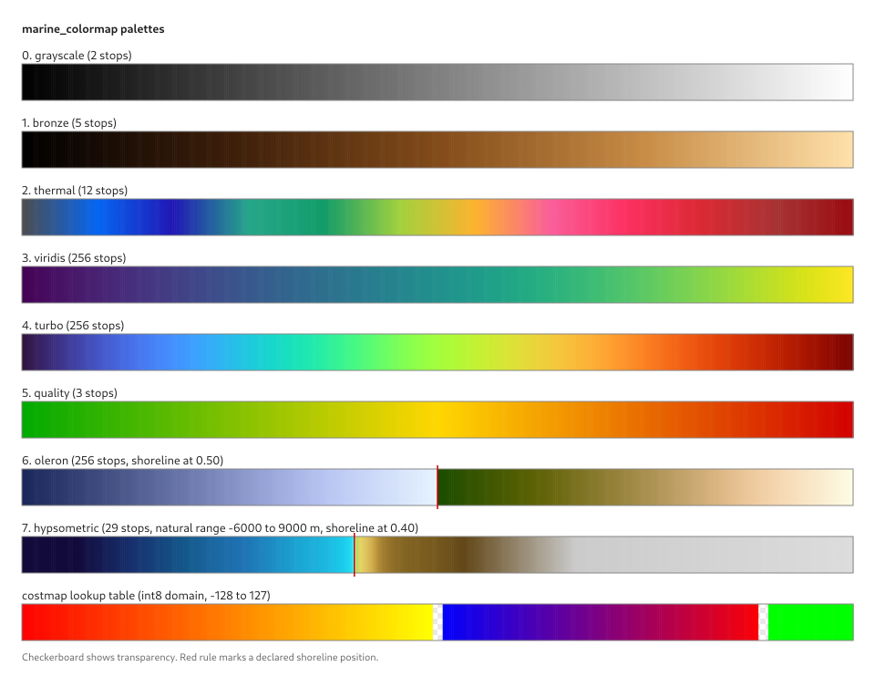

# Palettes

Every palette this package registers, plus the `costmap` lookup table.



The chart is **generated from the live registry** by the `palette_chart` tool, so it cannot
drift from the code. After adding or changing a palette, rebuild and run:

```bash
./docs/generate_palette_chart.sh
```

In the chart, the checkerboard shows transparency — the costmap's free-space entry is fully
transparent, not white — and the red rule marks a palette's declared shoreline position.

## What each one is for

| # | Name | Kind | Use | Provenance |
|---|---|---|---|---|
| 0 | `grayscale` | continuous | General scalar display | — |
| 1 | `bronze` | continuous | Sonar imagery; the sidescan default | Existing sonar definition |
| 2 | `thermal` | continuous | Sonar imagery | De-duplicated sonar thermal |
| 3 | `viridis` | continuous, perceptually uniform | General scientific display | matplotlib (van der Walt, Smith) — CC0 |
| 4 | `turbo` | continuous | High local discriminability | matplotlib (Mikhailov, Google) |
| 5 | `quality` | continuous, diverging | Bathymetric uncertainty: green good → red bad | ADR-0001 |
| 6 | `oleron` | continuous, **hard shoreline break** | Topo-bathy where bathymetry is the focus | Crameri, Scientific Colour Maps — MIT |
| 7 | `hypsometric` | continuous, elevation-keyed | Topo-bathy where land relief matters | GeoZui4D CLUT, CCOM/UNH — Apache-2.0 |
| — | `costmap` | **fixed-domain lookup** | ROS occupancy grids / nav2 costmaps | Matches rviz exactly |

Full licence terms for the vendored data are in
[`../THIRD_PARTY_NOTICES.md`](../THIRD_PARTY_NOTICES.md).

## The two topo-bathy palettes

They answer different questions, which is why both ship.

**`oleron`** is perceptually uniform on each side of a **hard discontinuity at the
shoreline**, expressed as two coincident stops at t = 0.5. Its sea side lightens toward
shore and its land side runs green to cream. It is the better choice where bathymetry is
the subject and the land is context — camp, most of the time.

**`hypsometric`** is the classic cartographic look: cyan-green shallows, yellow-green
lowlands, tans and browns rising, grey and white at altitude. Its stops are **literal
elevations** from −6000 to +9000 m, so it declares a natural range and puts its shoreline at
0.4 rather than the middle. Better where land relief is being contrasted, such as a 3D view.

Neither is stretched to the data by default. Anchor a palette's `shoreline_position` to a
data value with `BreakpointMap` (see [`lookup.hpp`](../marine_colormap/include/marine_colormap/lookup.hpp))
and each side stretches independently to fill its share of the colour range — so 80 m of
water and 5 m of land each get half the palette.

## The costmap table

Not a ramp. It is a `LookupTable` keyed by absolute `int8` values, so it **owns its domain**
and there is nothing for an operator to rescale. Colours match rviz's `palette_builder.cpp`:
transparent free space, a blue→red cost ramp, **cyan inscribed**, **magenta lethal**, green
for illegal positive values, a red→yellow ramp for illegal negatives, and blue-grey for
unknown.

`-1` is a **named entry, not the invalid-data sentinel** — in this domain it is a legal,
meaningful value.
